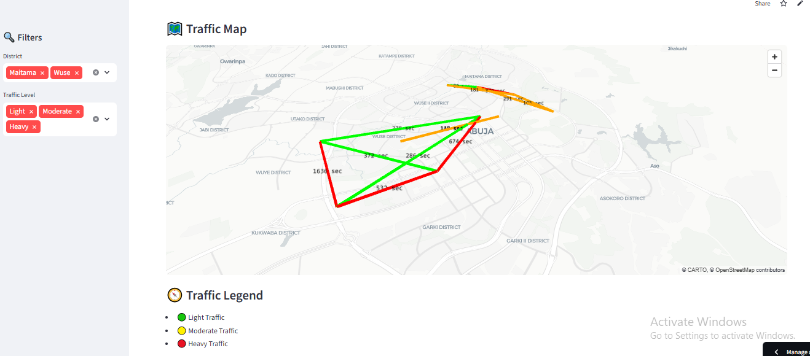

# 🚦 Multi-District Smart Traffic Intelligence System (Abuja)

An AI-powered traffic intelligence platform built with **Python, Streamlit, Machine Learning, GIS Mapping, and Route Optimization Algorithms** to analyze traffic conditions across multiple districts in Abuja, predict traffic flow, and recommend the fastest travel routes.

The project demonstrates how **Artificial Intelligence, Data Science, Geospatial Analytics, and Graph Algorithms** can be integrated into a single intelligent transportation system to support smarter mobility and urban planning.

---

# 🌐 Live Application

🔗 https://olonisakin-k-pa.streamlit.app/

---

# 📌 Project Overview

Urban traffic congestion remains one of the biggest challenges facing rapidly growing cities.

This project demonstrates how Artificial Intelligence can support intelligent transportation systems by combining:

- Machine Learning
- GIS Visualization
- Route Optimization
- Interactive Analytics

into one intelligent decision-support platform.

The application currently covers multiple districts across Abuja, including:

- Maitama
- Wuse
- Garki
- Berger Junction
- Eagle Square
- Area 10

Users can simulate traffic conditions, visualize congestion on an interactive GIS map, and identify the fastest routes between locations.

---

# 🎯 Problem → Solution → Impact

## Problem

Traffic congestion affects travel efficiency, productivity, and urban mobility. Transportation planners and road users often lack simple tools for analyzing traffic conditions and selecting optimal routes.

## Solution

This project integrates **Machine Learning, GIS visualization, graph-based route optimization, and interactive dashboards** into one intelligent transportation platform capable of analyzing traffic conditions and recommending efficient routes.

## Impact

Although developed as a prototype, the application demonstrates how Artificial Intelligence can support:

- Smarter route planning
- Traffic monitoring
- Intelligent transportation systems
- Smart city initiatives
- Evidence-based transportation planning

---

# 🚀 Key Features

## 🕒 Time-of-Day Simulation

Simulate traffic conditions during:

- Off-Peak
- Normal Traffic
- Rush Hour

---

## 🔍 Smart Traffic Filters

Filter traffic routes by:

- District
- Traffic Level (Light / Moderate / Heavy)

---

## 🤖 Machine Learning Prediction

A **Random Forest Regressor** predicts traffic speed using:

- Route Length
- Adjusted Travel Time

---

## 📊 Model Performance Dashboard

Displays:

- R² Score
- Mean Absolute Error (MAE)

---

## 🔄 Route Optimization

Uses the **NetworkX Shortest Path Algorithm** to determine:

- Fastest Route
- Estimated Travel Time (ETA)

---

## 🗺️ Interactive GIS Traffic Map

Built with **PyDeck**, the GIS dashboard displays:

- Road network visualization
- Traffic congestion colours
- Route labels
- Highlighted optimal routes

---

## 🧭 Traffic Legend

🟢 Light Traffic

🟡 Moderate Traffic

🔴 Heavy Traffic

---

# 📸 Application Screenshots

## 🖥️ Dashboard


---

## 🗺️ GIS Traffic Map



---

# 📍 GIS Traffic Map Overview

The interactive GIS Traffic Map enables users to explore traffic conditions across multiple Abuja districts.

### Sidebar Filters

Users can filter traffic data by:

- District
- Traffic Level

allowing focused traffic analysis.

---

### Route Visualization

Each coloured line represents a road segment connecting two locations.

Labels display estimated travel time.

Examples:

- **181 sec ≈ 3 minutes**
- **674 sec ≈ 11 minutes**

---

### Traffic Colours

🟢 Green — Light Traffic

🟡 Yellow — Moderate Traffic

🔴 Red — Heavy Traffic

---

### Benefits

The GIS dashboard enables users to:

- Detect congested roads
- Compare travel times
- Select optimal routes
- Support transportation planning
- Improve mobility decisions

---

# 🧠 Machine Learning Model

## Algorithm

**Random Forest Regressor**

### Input Features

- Route Length (km)
- Adjusted Travel Time (seconds)

### Predicted Output

- Average Travel Speed (km/h)

---

# 📊 Model Development & Evaluation

This application was developed as a **prototype** to demonstrate the integration of **Machine Learning, GIS visualization, graph-based route optimization, and interactive analytics** into a complete intelligent transportation platform.

The current version uses a demonstration dataset to validate the complete end-to-end workflow rather than maximize predictive accuracy.

One interesting observation during development was that the model's **R² score changed slightly between application runs**.

After investigating, I found that this was **not caused by an error in the code**. The variation occurred because the model was retrained each time using a different random split of the available data into training and testing sets.

With a relatively small demonstration dataset, different train-test splits naturally produce different evaluation results.

This reinforced an important lesson in Machine Learning:

> **Model performance depends not only on selecting an appropriate algorithm but also on the quality, quantity, and representativeness of the training data, as well as a reproducible evaluation strategy.**

Although the predictive model is still evolving, this project successfully demonstrates the integration of:

- Machine Learning
- GIS Mapping
- Route Optimization
- Interactive Dashboards
- Traffic Analytics
- Cloud Deployment

The next phase of development will focus on:

- Expanding the traffic dataset
- Using a fixed random seed (`random_state`) for reproducible experiments
- Comparing multiple regression algorithms
- Improving feature engineering
- Increasing predictive accuracy
- Integrating real-time traffic information

The objective of this project is not simply to build a prediction model, but to demonstrate how Artificial Intelligence can power an end-to-end intelligent transportation system.

---

# 🏗️ System Architecture

```text
Traffic Data
      │
      ▼
Data Processing (Pandas)
      │
      ▼
Machine Learning Model
(Random Forest Regressor)
      │
      ├──────────────┐
      ▼              ▼
Traffic Prediction   Route Optimization (NetworkX)
      │              │
      └──────┬───────┘
             ▼
GIS Visualization (PyDeck)
             ▼
Interactive Streamlit Dashboard
             ▼
Decision Support for Smart Mobility
```

---

# 🛠️ Technology Stack

### Programming

- Python

### Machine Learning

- Scikit-learn
- Random Forest Regressor

### Data Analysis

- Pandas

### Geospatial Analytics

- PyDeck

### Network Analysis

- NetworkX

### Web Framework

- Streamlit

---

# 📂 Project Structure

```text
Multi-Districts-Smart-Traffic-Intelligence-System-Abuja/
│── assets/
│   ├── Dashboard.png
│   ├── TrafficMap.png
│── dad8.py
│── requirements.txt
│── README.md
```

---

# ⚙️ Installation

## Clone Repository

```bash
git clone https://github.com/kola56de/Multi-Districts-Smart-Traffic-Intelligence-System-Abuja.git

cd Multi-Districts-Smart-Traffic-Intelligence-System-Abuja
```

## Install Dependencies

```bash
pip install -r requirements.txt
```

## Run Application

```bash
streamlit run dad8.py
```

---

# 🎯 Applications

- Intelligent Transportation Systems
- Smart Mobility
- Urban Traffic Monitoring
- Route Optimization
- GIS Transportation Analytics
- Smart City Planning
- Traffic Flow Prediction
- Transportation Decision Support

---

# 📈 Future Roadmap

- Google Maps Traffic API Integration
- AI Congestion Forecasting
- Accident Detection Alerts
- Public Transport Route Integration
- GPS-Based Vehicle Tracking
- Power BI Executive Dashboard
- Mobile Application
- Multi-City Deployment
- Larger Training Dataset (5,000+ Traffic Records)
- Advanced Machine Learning Model Comparison

---

# 👨‍💻 Author

## **Engr. Dr. Kolade Olonisakin, FNSE**

**Civil Engineer | Data Scientist | Machine Learning Engineer | AI Engineer | Transportation & GIS Analytics**

🌍 **Portfolio**

https://kola56de.github.io/Engr-Dr-Kolade-Portfolio.github.io/

💼 **LinkedIn**

https://www.linkedin.com/in/engr-dr-kolade-olonisakin-fnse/

💻 **GitHub**

https://github.com/kola56de

---

# ⭐ Support

If you found this project useful, please consider giving it a **⭐ Star** on GitHub.

Feedback, suggestions, and collaboration opportunities are always welcome.
